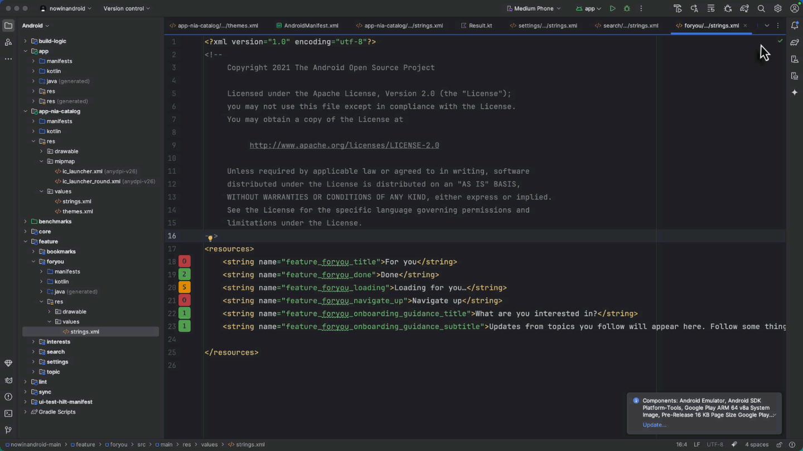

# Android Resource Usage Tracker

<!-- Plugin description -->
Track and visualize Android resource usage across your entire project with intuitive gutter icons and interactive popups.

**Features:**
- **Visual Usage Counters** - See at a glance how many times each resource is used with color-coded gutter icons
- **Interactive Click Navigation** - Click any usage counter to see all usages with code snippets and navigate directly to them
- **Cross-Module Search** - Finds usages across all modules in multi-module projects
- **AndroidManifest.xml Detection** - Detects theme and style references in manifest files
- **Smart Deduplication** - Uses PSI tree hashing to avoid duplicate results
- **Performance Optimized** - Word-based indexing for fast searches even in large projects
- **Supports All Resource Types** - Strings, colors, dimensions, styles, drawables, and more

**Perfect for:**
- Identifying unused resources for cleanup
- Understanding resource dependencies
- Refactoring with confidence
- Code reviews and audits
<!-- Plugin description end -->

## Demo

*Visual usage counters with color-coded badges: 🔴 Red (unused), 🟢 Green (1-4 uses), 🟠 Orange (5+ uses)*

## 🚀 Get Started

**Quick Install:** `Settings/Preferences` → `Plugins` → `Marketplace` → Search "Android Resource Usage Tracker"

## Usage

1. Open any Android resource file (e.g., `res/values/strings.xml`, `res/values/colors.xml`)
2. Look for colored badges in the gutter next to each resource definition
3. Click on any badge to see:
  - All usages across your project
  - Code snippets showing context
  - File paths and line numbers
4. Double-click any usage to navigate directly to that location

**Understanding the Badge Colors:**

| Color | Usage Count | Meaning | Action |
|-------|-------------|---------|--------|
| 🔴 Red | 0 | Unused resource | Safe to delete - consider cleanup |
| 🟢 Green | 1-4 | Normal usage | Standard resource, well-scoped |
| 🟠 Orange | 5+ | Heavily used | Core resource, refactor carefully |

## Supported Resource Types

- Strings (`<string>`)
- Colors (`<color>`)
- Dimensions (`<dimen>`)
- Styles and Themes (`<style>`)
- Drawables (`<drawable>`)
- Integers (`<integer>`)
- Booleans (`<bool>`)
- Arrays (`<array>`, `<string-array>`, `<integer-array>`)
- Plurals (`<plurals>`)
- IDs (`<id>`)

## Requirements

- Android Studio Hedgehog (2023.1.1) or newer
- IntelliJ IDEA 2023.3 or newer with Android plugin

## Installation

- **Using IDE built-in plugin system:**

  <kbd>Settings/Preferences</kbd> > <kbd>Plugins</kbd> > <kbd>Marketplace</kbd> > <kbd>Search for "Android Resource Usage Tracker"</kbd> > <kbd>Install</kbd>

- **Using JetBrains Marketplace:**

  Go to [JetBrains Marketplace](https://plugins.jetbrains.com/plugin/29552-android-resource-usage-tracker) and install it by clicking the <kbd>Install to ...</kbd> button in case your IDE is running.

  You can also download the [latest release](https://plugins.jetbrains.com/plugin/29552-android-resource-usage-tracker/versions) from JetBrains Marketplace and install it manually using
  <kbd>Settings/Preferences</kbd> > <kbd>Plugins</kbd> > <kbd>⚙️</kbd> > <kbd>Install plugin from disk...</kbd>

- **Manually:**

  Download the [latest release](https://github.com/dmitrish/android-resource-usage-tracker/releases/latest) and install it manually using
  <kbd>Settings/Preferences</kbd> > <kbd>Plugins</kbd> > <kbd>⚙️</kbd> > <kbd>Install plugin from disk...</kbd>

## Known Limitations

- Does not track resources used via reflection or dynamic resource loading
- Generated files (R.java, BuildConfig) are excluded from usage counts
- First-time indexing may take a moment in very large projects

## Contributing

Contributions are welcome! Please feel free to submit a Pull Request.

## License

This project is licensed under the MIT License - see the [LICENSE](LICENSE) file for details.

## Support

If you encounter any issues or have feature requests, please [open an issue](https://github.com/dmitrish/android-resource-usage-tracker/issues) on GitHub.

---
Plugin based on the [IntelliJ Platform Plugin Template][template].

[template]: https://github.com/JetBrains/intellij-platform-plugin-template
[docs:plugin-description]: https://plugins.jetbrains.com/docs/intellij/plugin-user-experience.html#plugin-description-and-presentation